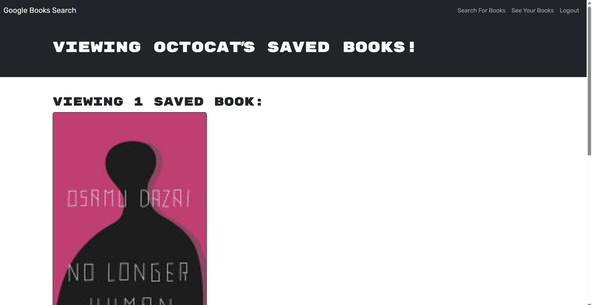

# BookWorm – MERN Book Search Engine

BookWorm is a full-stack MERN application that allows users to search for books using the Google Books API and save their favorites to a personal list. The app has been fully refactored from a RESTful architecture to use GraphQL with Apollo Server, providing a modern and efficient approach to querying and mutating data.

## Live Deployment

[Render Deploment](https://your-render-link-here.com)

---

## Screenshots

### Search Page

### Saved Books Page

---

## Technologies Used

- **MongoDB + Mongoose**
- **Express.js**
- **React + Vite + TypeScript**
- **Node.js**
- **GraphQL + Apollo Server/Client**
- **JWT Authentication**
- **Google Books API**
- **Render (Deployment)**

---

## Features

- **Search for books** using Google Books API
- **Save and delete books** to/from a user’s account
- **Authentication system** with JWT (login/signup)
- **Apollo GraphQL server** replaces old REST API
- **Responsive design** using React Bootstrap
- **Deployed on Render** with MongoDB Atlas integration

---

## Installation

To use the application use the render link up above.